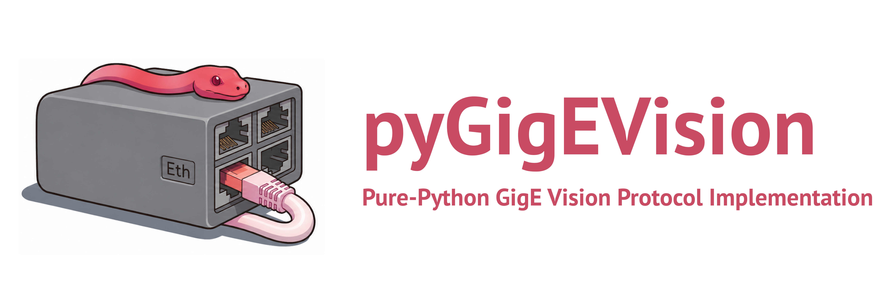

pyGigEVision
============

|tests| |docs| |license| |python|

Pure-Python implementation of the GigE Vision protocol, covering GVCP
(control) and GVSP (streaming), for machine vision cameras.
``pyGigEVision`` is the foundation other vendor-specific GigE Vision
camera drivers can build on top of. It exposes the protocol primitives
(discovery, control register access, streaming reception, and GenICam
descriptor download) without bundling any vendor-specific behaviour.
For example, ``pyTelops`` (a driver for Telops infrared cameras) builds
on this protocol layer.

The protocol implementation is pure Python: no vendor SDKs, no GenTL producers.

Installation
------------

.. code-block:: bash

    pip install pyGigEVision

Requires Python 3.10 or newer.

Quickstart
----------

.. code-block:: python

    from pyGigEVision import discover, bootstrap, GVSPReceiver

    # Find all GigE Vision cameras on the network
    cameras = discover(timeout=2.0)
    print(cameras)

    # Connect to the first one, take control, fetch its GenICam XML
    client, xml = bootstrap(cameras[0]["ip"])
    print(f"Downloaded {len(xml)} bytes of GenICam XML")

    # From here, configure vendor-specific registers (Width, Height,
    # PixelFormat, ...) via client.write_reg() and receive frames via
    # GVSPReceiver. See the documentation for a complete example.

    client.disconnect()

``discover()`` searches all host network interfaces by default, so cameras
on secondary NICs and USB-to-GigE adapters are found without naming an
interface.

Documentation
-------------

Full documentation at https://pygigevision.readthedocs.io.

Examples (vendor-neutral, runnable against any GigE Vision camera) are
in the ``examples/`` directory.

Projects using pyGigEVision
---------------------------

- `pyTelops <https://github.com/ladisk/pyTelops>`_ - driver for Telops
  infrared cameras.
- `pyFlir <https://github.com/LolloCappo/pyFlir>`_ - driver for FLIR
  cameras.

Status
------

Beta. Public API is stable; minor releases may add features or fix
bugs.

License
-------

MIT.

Disclaimer
----------

``pyGigEVision`` is an independent project and is not affiliated with,
endorsed by, or sponsored by the AIA (Association for Advancing
Automation) or any camera manufacturer. "GigE Vision" is a registered
trademark of the AIA.

.. |tests| image:: https://github.com/ladisk/pyGigEVision/actions/workflows/test.yml/badge.svg
   :target: https://github.com/ladisk/pyGigEVision/actions/workflows/test.yml
   :alt: Tests

.. |docs| image:: https://readthedocs.org/projects/pygigevision/badge/?version=latest
   :target: https://pygigevision.readthedocs.io/en/latest/
   :alt: Documentation

.. |license| image:: https://img.shields.io/badge/license-MIT-blue.svg
   :target: https://github.com/ladisk/pyGigEVision/blob/main/LICENSE
   :alt: License: MIT

.. |python| image:: https://img.shields.io/pypi/pyversions/pyGigEVision.svg
   :target: https://pypi.org/project/pyGigEVision/
   :alt: Python versions
